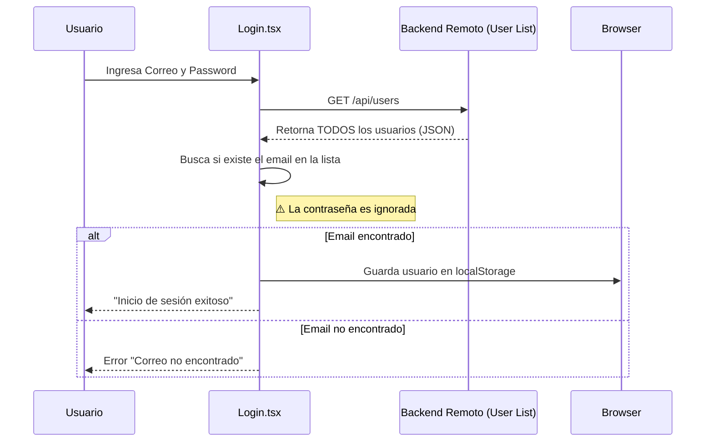

# 🔐 Documentación del Sistema de Login

## Descripción General

El sistema de autenticación actual funciona como un mecanismo provisional ("Placeholder") basado en validación del lado del cliente (Client-Side Validation).

Actualmente, el sistema no realiza una autenticación tradicional contra un endpoint de seguridad (`/login`), sino que descarga la lista de usuarios y verifica la existencia del correo electrónico introducido directamente en el navegador.

---

## 📡 Endpoints Utilizados

El flujo de login depende exclusivamente de un endpoint de consulta general de la API remota.

### 1. Obtener Lista de Usuarios

Este endpoint es consumido por el componente `Login.tsx` para recuperar la base de datos de usuarios y buscar coincidencias localmente.

* **Método:** `GET`
* **URL:** `http://172.105.21.15:3000/api/users`
* **Autenticación requerida:** Ninguna.

**Respuesta Exitosa (200 OK):**

```json
{
  "success": true,
  "data": [
    {
      "uid": "user123",
      "email": "usuario@ejemplo.com",
      "name": "Usuario Ejemplo",
      "company": "Empresa S.A.",
      "createdAt": "2025-11-09T00:00:00.000Z",
      // ...otros datos del usuario
    }
    // ...otros usuarios
  ],
  "count": 1
}

```

---

## ⚙️ Flujo Lógico de Autenticación

El proceso de inicio de sesión se ejecuta íntegramente en el frontend (`Login.tsx`) siguiendo estos pasos:

1. **Entrada de Datos:** El usuario ingresa su correo y contraseña en el formulario.
2. **Petición de Datos:** Al enviar el formulario, la función `verificarUsuario(correo)` realiza un `fetch` al endpoint `GET /api/users`.
3. **Filtrado Local:**
* El código itera sobre el array `data.data` recibido.
* Busca un usuario cuyo `email` coincida con el ingresado (sin distinción de mayúsculas/minúsculas).


4. **Validación:**
* **Si existe el correo:** Se considera el login exitoso. **La contraseña ingresada es ignorada y no se valida.**
* **Si no existe:** Retorna error "Correo no encontrado".


5. **Persistencia de Sesión:**
* Si el login es exitoso, el objeto completo del usuario se guarda en `localStorage` bajo la clave `"usuarioActual"`.
* Se dispara un evento de ventana `auth-change` para actualizar la UI (NavBar, Perfil, etc.).


### Diagrama de Secuencia



---

## ⚠️ Estado Actual: Limitaciones y Riesgos

> **Nota:** Esta implementación es funcional únicamente para entornos de desarrollo temprano o pruebas de concepto (MVP/PoC). No es apta para producción.

### 1. Validación de Credenciales Inexistente

El sistema **no verifica la contraseña**. Cualquier usuario puede iniciar sesión en cualquier cuenta simplemente conociendo la dirección de correo electrónico del usuario objetivo.

### 2. Exposición de Datos (Data Leak)

Al hacer `GET /api/users` en el login, se descargan **todos los datos de todos los usuarios** al navegador del cliente. Un usuario con conocimientos básicos puede inspeccionar la red y ver la información (nombres, correos, empresas, teléfonos) de toda la base de datos.

### 3. Carga Ineficiente

A medida que crezca la base de usuarios, descargar la lista completa para hacer un login será insosteniblemente lento y consumirá excesivo ancho de banda.

---

## 🚀 Roadmap: A futuro / Por mejorar

Para evolucionar este placeholder a un sistema de producción seguro, se deben implementar los siguientes cambios (Sprint Backlog sugerido):

### Alta Prioridad (Seguridad Crítica)

* [ ] **Implementar Endpoint de Login Real:** Crear un endpoint `POST /api/auth/login` en el backend que reciba `{ email, password }`.
* [ ] **Validación en Backend:** El servidor debe buscar al usuario, hashear la contraseña recibida y compararla con el hash guardado en la base de datos (usando bcrypt, como sugiere la documentación del registro).
* [ ] **Eliminar lógica de filtrado en cliente:** El frontend solo debe enviar credenciales y recibir éxito/error, nunca la lista completa de usuarios.

### Media Prioridad (Sesión y Seguridad)

* [ ] **Implementar JWT (JSON Web Tokens):** En lugar de guardar el objeto usuario crudo en `localStorage`, el backend debe retornar un token firmado (`accessToken`).
* [ ] **Manejo de Sesión Seguro:** Almacenar el token en una Cookie `HttpOnly` o gestionarlo de manera segura en el cliente para peticiones autenticadas.

### Baja Prioridad (Mantenimiento)

* [ ] **Variables de Entorno:** Reemplazar la IP hardcodeada `http://172.105.21.15:3000` por variables de entorno (`NEXT_PUBLIC_API_URL`) para facilitar el despliegue en distintos ambientes.